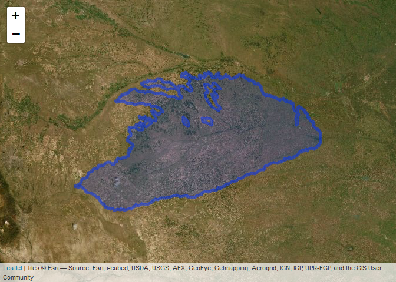
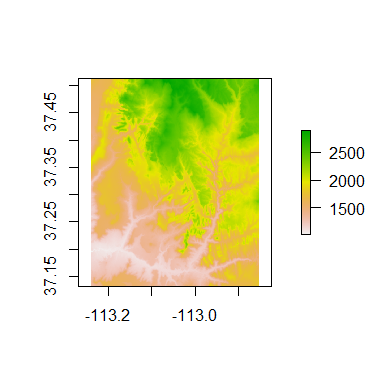
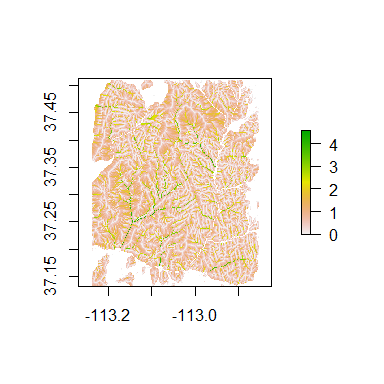
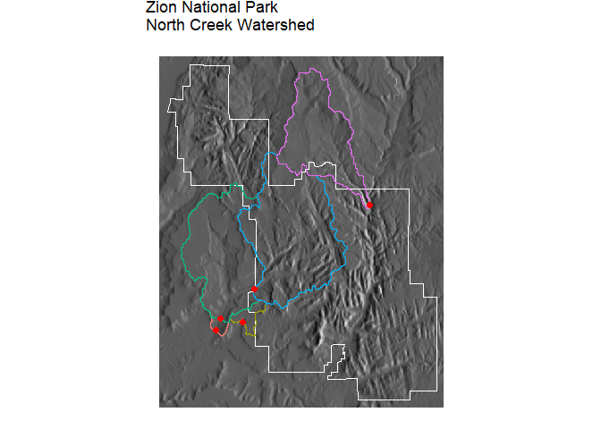
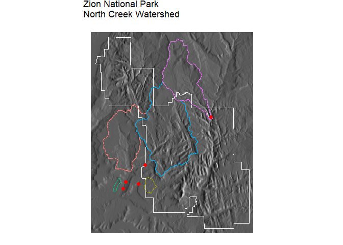

<!-- README.md is generated from README.Rmd. Please edit that file -->

# watershedtools

The goal of `watershedtools` is to delineate watersheds using packages
like nhdplusTools and others. Most methods will work best for the
continental U.S.

## Installation

You can install watershedtools from github using devtools:

``` r
devtools::install_github("tylerbhampton/watershedtools")
```

## Test Watershed Delineation with nhdplusTools

``` r
library(watershedtools)
library(ggplot2)
library(leaflet)
library(sf)

# Point for Harlan County Lake on the Republican River, Nebraska USA
p=c(-99.189990,40.071521)

wsshape=NHDWBDws(method = "point",point = p,
         WBDstagepath = "B:/MASTERDATA/data_Hydrology/hydrology_shapefiles/USA_WBD_WatershedBoundaryDataset")


leaflet(data = wsshape) %>% leaflet::addPolygons() %>% leaflet::addProviderTiles("Esri.WorldImagery")
```

<!-- -->

## Test Watershed Delineation with RQGIS3

Note, you need OSGeo4W installed on your computer to use this package.
See the installation tutorial in the OSGeo folder on Github.

### Install R Packages

``` r
devtools::install_github("jannes-m/RQGIS3")
devtools::install_github("Nowosad/spData")
devtools::install_github("Nowosad/spDataLarge")
```

### Start up RStudio

``` r
suppressPackageStartupMessages({
library("raster")
library("dplyr")
library("sf")
library("ggplot2")
library("RQGIS3")
})
set_env("C:/OSGeo4W64")
#> $root
#> [1] "C:/OSGeo4W64"
#> 
#> $qgis_prefix_path
#> [1] "C:/OSGeo4W64/apps/qgis-ltr"
#> 
#> $python_plugins
#> [1] "C:/OSGeo4W64/apps/qgis-ltr/python/plugins"
#> 
#> $platform
#> [1] "Windows"
```

``` r
qgis_session_info()
#> $gdal
#> [1] "2.4.1"
#> 
#> $grass7
#> [1] FALSE
#> 
#> $qgis_version
#> [1] "3.4.8-Madeira"
#> 
#> $saga
#> [1] "2.3.2"
version
#>                _                           
#> platform       x86_64-w64-mingw32          
#> arch           x86_64                      
#> os             mingw32                     
#> system         x86_64, mingw32             
#> status                                     
#> major          3                           
#> minor          6.2                         
#> year           2019                        
#> month          12                          
#> day            12                          
#> svn rev        77560                       
#> language       R                           
#> version.string R version 3.6.2 (2019-12-12)
#> nickname       Dark and Stormy Night
```

R will identify for you the current version of QGIS running on your
computer.

### Test using Zion National Park Data

We will use a digital elevation model (DEM) of Zion National Park, Utah,
USA, to construct watersheds. The geographic system is in
latitude-longitude (WGS84) and elevation is in meters. The most apparent
feature on the landscape is the Virgin River, which drains the plateau
in the northeast corner of the map and exists to the southwest.

``` r
dem=spDataLarge::elevation
plot(dem)
```

<!-- -->

### RQGIS functionality

Our first task for watershed deliniation is to fill the sinks in the
dem, to make sure all water drains out. We use the *find\_algorithms*
function to query the python libraries. We can simply add the string
“sinks”.

``` r
find_algorithms("sinks")
#> [1] "Fill sinks------------------------------------------->saga:fillsinks"          
#> [2] "Fill sinks (qm of esp)------------------------------->saga:fillsinksqmofesp"   
#> [3] "Fill sinks (wang & liu)------------------------------>saga:fillsinkswangliu"   
#> [4] "Fill sinks xxl (wang & liu)-------------------------->saga:fillsinksxxlwangliu"
```

We will use the saga library *fillsinks* function.

Next, the *get\_usage* and *get\_args\_man* functions describe the
inputs, parameters, and outputs of the functions. We see that the
required input is DEM, a dem, and the output is named RESULT, which
gives us our filled dem.

``` r
get_usage("saga:fillsinks")
#> Fill sinks (saga:fillsinks)
#> 
#> 
#> ----------------
#> Input parameters
#> ----------------
#> 
#> DEM: DEM
#> 
#>  Parameter type: QgsProcessingParameterRasterLayer
#> 
#>  Accepted data types:
#>      - str: layer ID
#>      - str: layer name
#>      - str: layer source
#>      - QgsProperty
#>      - QgsRasterLayer
#> 
#> MINSLOPE: Minimum Slope [Degree]
#> 
#>  Parameter type: QgsProcessingParameterNumber
#> 
#>  Accepted data types:
#>      - int
#>      - float
#>      - QgsProperty
#> 
#> RESULT: Filled DEM
#> 
#>  Parameter type: QgsProcessingParameterRasterDestination
#> 
#>  Accepted data types:
#>      - str
#>      - QgsProperty
#>      - QgsProcessingOutputLayerDefinition
#> 
#> ----------------
#> Outputs
#> ----------------
#> 
#> RESULT:  <QgsProcessingOutputRasterLayer>
#>  Filled DEM
get_args_man("saga:fillsinks")
#> $DEM
#> [1] "None"
#> 
#> $MINSLOPE
#> [1] "0.01"
#> 
#> $RESULT
#> [1] "None"
```

Finally, we can integrate these with the *run\_qgis* function, defining
the algorithm and its parameters. We can supply a file path for the
output. Saga packages can only output as .sdat files, not .tif. We will
use .tif later.

``` r
temppath=tempdir()

demfill = run_qgis(alg = "saga:fillsinks",
                   DEM=dem,
                   RESULT=file.path(temppath, "demfill.sdat"),
                   load_output = FALSE,
                   show_output_paths=FALSE)

run_qgis(alg = "grass7:r.watershed",
         elevation=file.path(temppath, "demfill.sdat"),
         threshold=1000,
         accumulation=file.path(temppath, "acc.tif"),
         drainage=file.path(temppath, "flowdir.tif"),
         load_output = FALSE,
         show_output_paths=FALSE)

flowacc=raster(file.path(temppath, "acc.tif"))
flowacc=calc(flowacc,function(x){ifelse(x>0,log10(x),NA)})
names(flowacc)="acc"
plot(flowacc)
```

<!-- -->

Plotting the log of flow accumulation, we can see several rivers shown
in green with high accumulation. For a dem, any cell that accumulates
water from outside the boundary is negative.

### RQGIS functionality

We will use these calculated raster products to draw watersheds from
several points on the landscape. First, we will calculate a list of
points on the raster where flow accumulation is greater than our
threshold (1000), and then use *lapply* to snap each of our points to
the raster coordinates.

``` r
zionpoints=list(
  c(-113.1634, 37.2176),
  c(-113.1,37.22833),
  c(-113.17,37.23083),
  c(-113.11,37.253),
  c(-112.954,37.3525)
)

r.pts <- as.data.frame(rasterToPoints(flowacc))
subset=r.pts[r.pts$acc>3,]

points.s=lapply(1:length(zionpoints),function(i){
  p=zionpoints[[i]]
  row=which.min(abs(subset$x-p[1])+abs(subset$y-p[2]))
  return(subset[row,1:2])
})
```

Next, for each point, we will use the flow direction raster to create a
watershed boundary, and then convert that raster to a vector shapefile.

``` r

for(i in 1:length(zionpoints)){
  run_qgis(alg = "grass7:r.water.outlet",
           input=file.path(temppath, "flowdir.tif"),
           coordinates=paste(as.vector(unlist(points.s[[i]])),collapse=","),
           output=file.path(tempdir(), paste0("basin",i,".tif")),
           load_output = FALSE,
           show_output_paths=FALSE)
  run_qgis(alg="grass7:r.to.vect",
           input=file.path(temppath, paste0("basin",i,".tif")),
           type=2L,
           output=file.path(temppath, paste0("basin",i,".shp")),
           load_output = FALSE,
           show_output_paths=FALSE)
}
```

Finally, we will convert our points to a shape layer, and read in all
our basin shapefiles as one joined layer. The boundary of zion national
park comes with the spDataLarge package. And to add aesthetic to the
map, we will make a hillshade baselayer.

``` r

point.d=do.call("rbind",points.s)%>%as.data.frame()
names(point.d)=c("lon","lat")
coordinates(point.d)=c("lon","lat")
crs(point.d)=proj4string(dem)

basins.d=do.call("rbind",lapply(
  1:length(zionpoints),function(i){
    l=st_read(file.path(tempdir(), paste0("basin",i,".shp")),quiet = T)
    l$value=i
    l=l[1,]
    return(l)
  }
))

zion=system.file("vector/zion.gpkg", package = "spDataLarge")%>%
  st_read()%>%st_transform(.,proj4string(dem))
#> Reading layer `zion' from data source `C:\Users\Tyler\Documents\R\win-library\3.6\spDataLarge\vector\zion.gpkg' using driver `GPKG'
#> Simple feature collection with 1 feature and 11 fields
#> geometry type:  POLYGON
#> dimension:      XY
#> bbox:           xmin: 302903.1 ymin: 4112244 xmax: 334735.5 ymax: 4153087
#> epsg (SRID):    NA
#> proj4string:    +proj=utm +zone=12 +ellps=GRS80 +towgs84=0,0,0,0,0,0,0 +units=m +no_defs
hillshade = run_qgis(alg = "grass7:r.relief",
                     input=dem,
                     output=file.path(tempdir(), "hillshade.tif"),
                     load_output = TRUE,
                     show_output_paths = FALSE)


ggplot()+
  geom_tile(data=as.data.frame(rasterToPoints(hillshade)),aes(x=x,y=y,fill=hillshade))+
  scale_fill_gradientn(colors=c("white",1))+
  geom_tile(data=subset(as.data.frame(rasterToPoints(flowacc)),acc>1000 | acc<{-100}),aes(x=x,y=y))+
  geom_sf(data=zion,col="white",fill="transparent")+
  geom_sf(data=basins.d,aes(col=factor(value)),fill="transparent")+
  geom_point(data=as.data.frame(point.d),aes(x=lon,y=lat),size=2,col=2)+
  ggsn::blank()+theme(legend.position = "n")+
  ggtitle("Zion National Park\nNorth Creek Watershed")
```

<!-- --> \#\# Compare
RQGIS3 and nhdplustools

``` r
zionNHDwatersheds=do.call("rbind",lapply(1:5,function(i){
  NHDWBDws(method = "point",point = zionpoints[[i]],
         WBDstagepath = "B:/MASTERDATA/data_Hydrology/hydrology_shapefiles/USA_WBD_WatershedBoundaryDataset")
}))
#> [1] "Proceed: No Upstream Flowlines"
#> [1] "Proceed: No Upstream Flowlines"
zionNHDwatersheds$value=1:5


ggplot()+
  geom_tile(data=as.data.frame(rasterToPoints(hillshade)),aes(x=x,y=y,fill=hillshade))+
  scale_fill_gradientn(colors=c("white",1))+
  geom_tile(data=subset(as.data.frame(rasterToPoints(flowacc)),acc>1000 | acc<{-100}),aes(x=x,y=y))+
  geom_sf(data=zion,col="white",fill="transparent")+
  geom_sf(data=zionNHDwatersheds,aes(col=factor(value)),fill="transparent")+
  geom_point(data=as.data.frame(point.d),aes(x=lon,y=lat),size=2,col=2)+
  ggsn::blank()+theme(legend.position = "n")+
  ggtitle("Zion National Park\nNorth Creek Watershed")
```

<!-- -->
